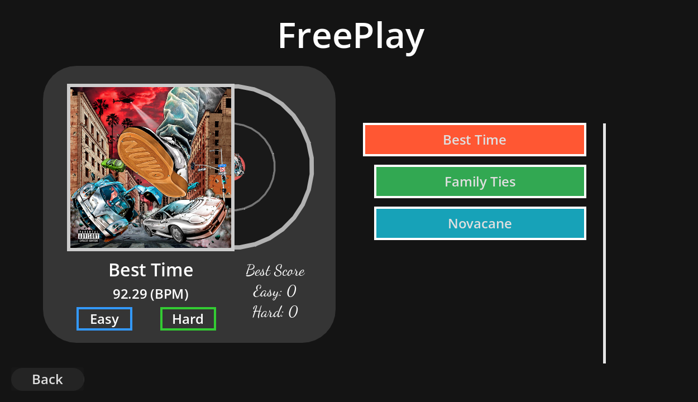
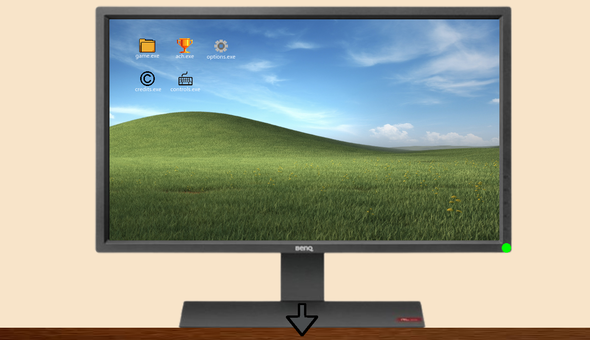
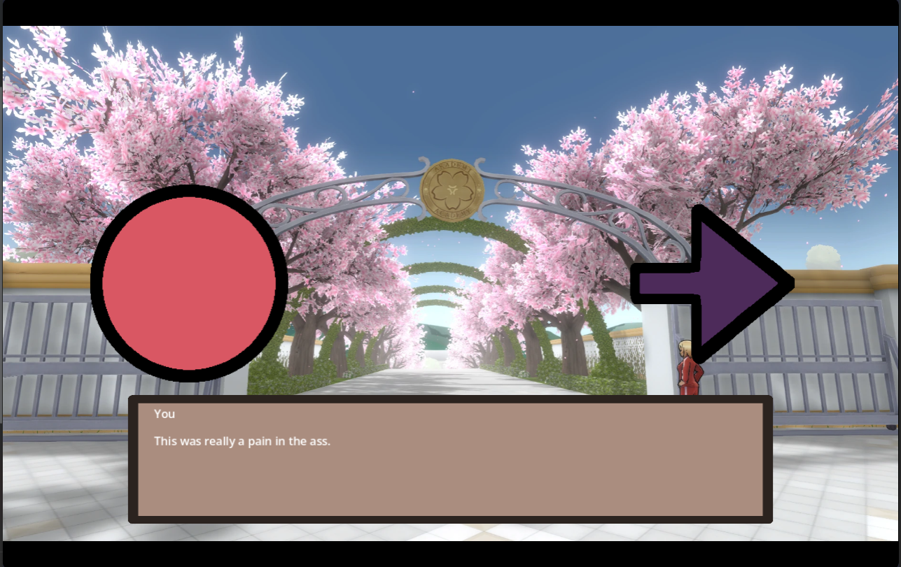

This is a rhythm game made for the Remixed YSWS from Hack Club. For the 1.0 Official Release I actually thought to write
some important info for the game.

The Game was made with the GDScript engine in Godot. I used AI for debugging and implementation help. All of the credits and
file links can be found in the textures.txt. The game was made in a month and a half and had the goal project time of 24 hrs
(this is not getting the 25 notes/hr 💀🙏)

But, after yapping the main features of the game.

This games custom made aspects:
- Custom made note engine (They come from up and down)
- Custom made Charting system and Separate Chart Editor (Still WIP)
- Custom made cutscene engine with sound effects, images and characters
- Custom Achivements and Arrow style engine.
- 80% of the textures and assets drawn by ME (i know they are bad)
- A weird kind of aesthetic

- The game includes as of the 1.0 version:
    - 4 songs for freeplay
    - 2̶ ̶S̶t̶o̶r̶y̶ ̶M̶o̶d̶e̶ ̶l̶e̶v̶e̶l̶s̶  (Didn't have enough time, coming in v1.1)
    - 4 Arrow styles
    - Multiple Achivements
    - Discoverable outside/inside Area
    - S̶o̶m̶e̶w̶h̶a̶t̶ ̶p̶u̶t̶ ̶t̶o̶g̶e̶t̶h̶e̶r̶ ̶s̶t̶o̶r̶y̶  (Didn't have enough time, coming in v1.1)
    - Easy cutscene, charting, character and song making for anyone
    - BG music and sound effects
    - Built in Auto Charter

- IMPORTANTLY! More is coming in the next coming updated. I just ran put of time to ship 😭

Some Images of the Game:

Freeplay Menu

Computer Screen

First Cutscene
